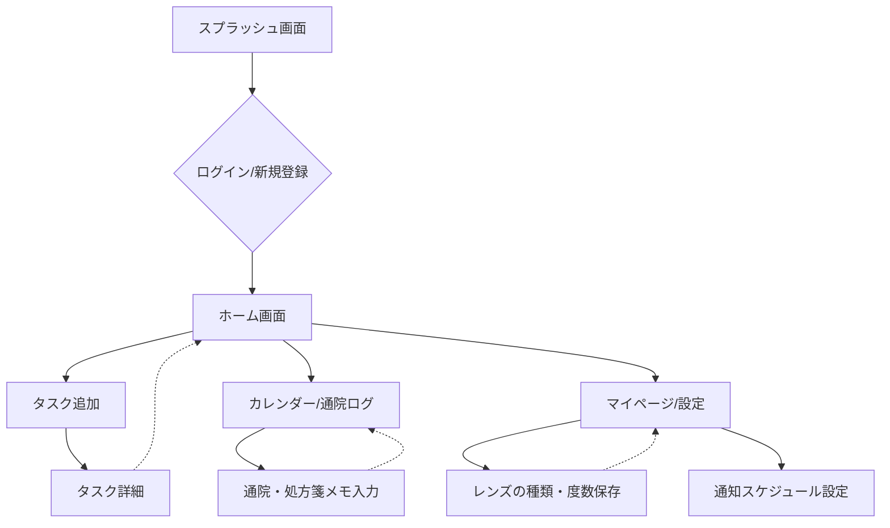
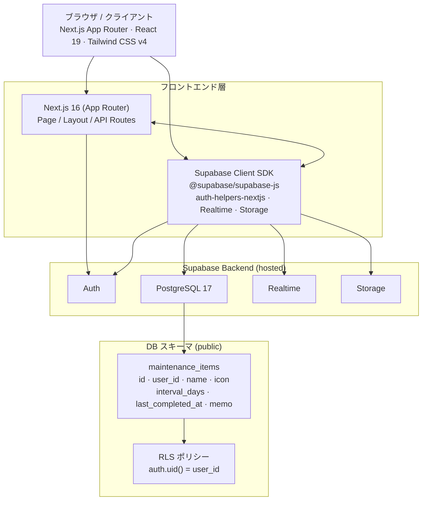
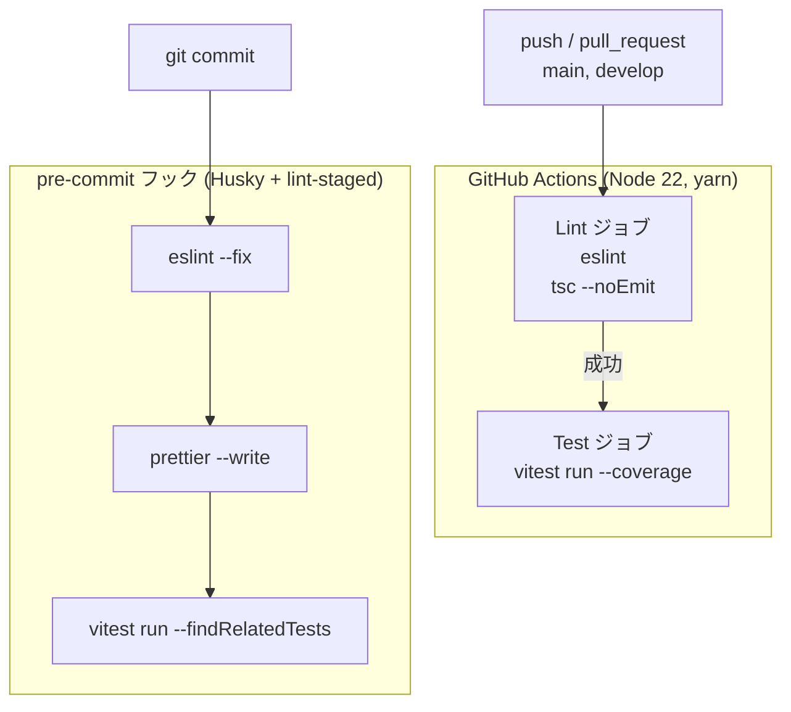

# SelfMaintenance - アプリケーション仕様書

## 1. アプリケーション概要

「SelfMaintenance」は、コンタクトレンズの交換、通院の記録、日々の生活に関わる定期的なタスクなどを一元管理し、ユーザー自身の日常的なメンテナンスをサポートするためのWebアプリケーションです。

## 2. 画面遷移と機能構成

アプリケーション内の主要な画面および遷移の流れは以下の通りです。

- **ホーム画面**: アプリのメインダッシュボード。ここからそれぞれの機能へアクセスします。
- **タスク機能**: 定期的なメンテナンスタスクを追加・詳細管理します。
- **通院ログ・カレンダー**: 通院の記録や処方箋のメモなどを管理する機能。
- **マイページ・設定**: コンタクトレンズ等の特定の設定情報や、通知スケジュールの管理などを行います。

## 3. システムアーキテクチャ

システム全体はバックエンド（BaaS）としてSupabaseを利用し、フロントエンドにNext.jsを採用した構成となっています。

### 技術スタック

| カテゴリ          | 技術                     |
| ----------------- | ------------------------ |
| フレームワーク    | Next.js 16 (App Router)  |
| UI ライブラリ     | React 19                 |
| スタイリング      | Tailwind CSS v4          |
| 言語              | TypeScript 5.x           |
| バックエンド / DB | Supabase (PostgreSQL 17) |
| 認証              | Supabase Auth            |
| パッケージ管理    | yarn                     |
| プラットフォーム  | Vercel                   |

## 4. データモデル (Supabase)

### テーブル: `public.maintenance_items`

定期的なメンテナンスタスクを保存する主要テーブルです。

| カラム名            | 型            | 制約                                              | 説明                           |
| ------------------- | ------------- | ------------------------------------------------- | ------------------------------ |
| `id`                | `uuid`        | PK, `gen_random_uuid()`                           | レコード識別子                 |
| `user_id`           | `uuid`        | NOT NULL, FK → `auth.users(id)` ON DELETE CASCADE | オーナーユーザー               |
| `name`              | `text`        | NOT NULL                                          | メンテナンス項目名             |
| `icon`              | `text`        | nullable                                          | 絵文字アイコン                 |
| `interval_days`     | `integer`     | NOT NULL                                          | 繰り返し間隔（日数）           |
| `last_completed_at` | `timestamptz` | NOT NULL, default `now()`                         | 最終完了日時                   |
| `memo`              | `text`        | nullable                                          | メモ                           |
| `created_at`        | `timestamptz` | NOT NULL, default `now()`                         | 作成日時                       |
| `updated_at`        | `timestamptz` | NOT NULL, default `now()`                         | 更新日時（trigger で自動更新） |

#### Row Level Security (RLS)

ユーザーは「自分自身のデータ」にのみアクセスできるようRLSで保護されています。各テーブル操作での保護条件は以下の通りです。

- クエリ・操作の条件: `auth.uid() = user_id` （SELECT、INSERT、UPDATE、DELETE すべて共通）

## 5. 開発およびCI/CD環境

以下のようなツールチェーンを用いてコード品質向上と自動化が導入されています。

- **テスト**: Vitest 4.x, `@testing-library/react`
- **リンター / フォーマッター**: ESLint 9 (eslint-config-next), Prettier
- **Git フック**: Husky + lint-staged を用いて、コミット時にリント、フォーマット修正、および関連テストを自動実行。
- **CI/CD環境 (GitHub Actions)**: `yarn`でのジョブ実行として、lint チェックおよび vitest のカバレッジを含めたテストが pull_request や push のタイミングで走ります。

