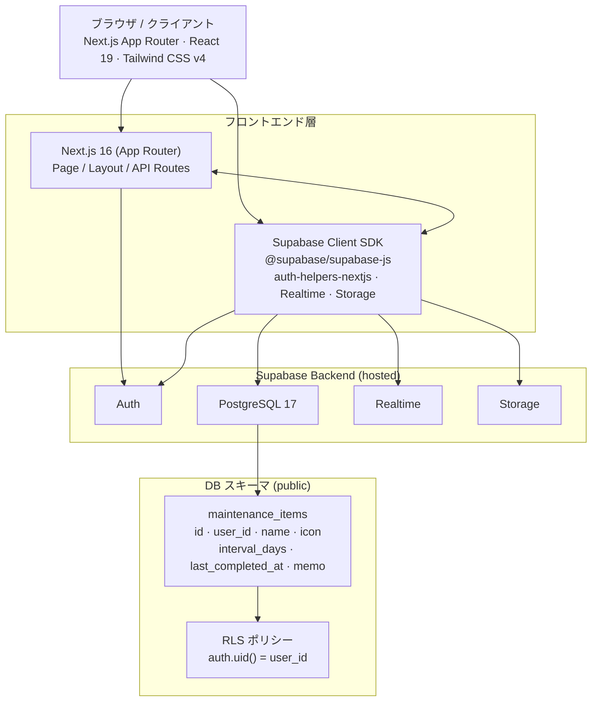
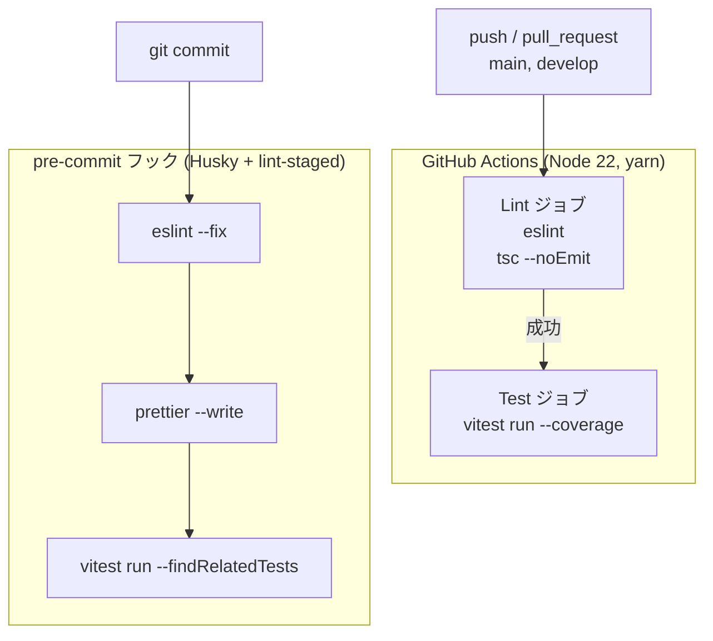

# メグループ — アーキテクチャ・ドキュメント

## 1. システム全体アーキテクチャ



## 2. ディレクトリ構造

```directory architecture
/ (root)
├── src/
│   ├── app/
│   │   ├── page.tsx          # トップページ
│   │   ├── layout.tsx        # ルートレイアウト（Geist フォント設定）
│   │   └── globals.css       # グローバルスタイル（Tailwind v4 import）
│   └── test/
│       ├── setup.ts          # テストセットアップ（@testing-library/jest-dom）
│       └── sample.test.ts    # サンプルテスト
│
├── supabase/
│   ├── config.toml           # Supabase ローカル設定（ポート・認証・ストレージ等）
│   ├── seed.sql              # テストデータ投入スクリプト
│   ├── .gitignore
│   └── migrations/           # テーブル定義・RLS ポリシー・updated_at トリガー
│
├── public/
│
├── .github/
│   ├── workflows/
│   │   └── ci.yml            # CI: lint → typecheck → test --coverage
│   ├── ISSUE_TEMPLATE/
│   │   ├── bug_report.yml
│   │   └── feature_request.yml
│   ├── PULL_REQUEST_TEMPLATE.md
│   └── dependabot.yml        # npm / GitHub Actions 週次自動更新
│
├── .husky/
│   └── pre-commit            # lint-staged 実行
│
├── docs/
│   └── architecture.md       # アーキテクチャ記述
│
├── package.json
├── tsconfig.json
├── vitest.config.ts
├── postcss.config.mjs
├── next.config.ts
├── eslint.config.mjs
├── commitlint.config.js
├── .env.example
├── .vercelignore
├── AGENTS.md
├── CLAUDE.md
└── README.md
```

## 3. Supabase データモデル

### テーブル: `public.maintenance_items`

| カラム名            | 型            | 制約                                              | 説明                           |
| ------------------- | ------------- | ------------------------------------------------- | ------------------------------ |
| `id`                | `uuid`        | PK, `gen_random_uuid()`                           | レコード識別子                 |
| `user_id`           | `uuid`        | NOT NULL, FK → `auth.users(id)` ON DELETE CASCADE | オーナーユーザー               |
| `name`              | `text`        | NOT NULL                                          | 定期タスク名                   |
| `icon`              | `text`        | nullable                                          | 絵文字アイコン                 |
| `interval_days`     | `integer`     | NOT NULL                                          | 繰り返し間隔（日数）           |
| `last_completed_at` | `timestamptz` | NOT NULL, default `now()`                         | 最終完了日時                   |
| `memo`              | `text`        | nullable                                          | メモ                           |
| `created_at`        | `timestamptz` | NOT NULL, default `now()`                         | 作成日時                       |
| `updated_at`        | `timestamptz` | NOT NULL, default `now()`                         | 更新日時（trigger で自動更新） |

### Row Level Security (RLS) ポリシー

RLS が有効化されており、全操作でログインユーザー自身のデータのみアクセス可能。

| 操作   | ポリシー条件           |
| ------ | ---------------------- |
| SELECT | `auth.uid() = user_id` |
| INSERT | `auth.uid() = user_id` |
| UPDATE | `auth.uid() = user_id` |
| DELETE | `auth.uid() = user_id` |

### トリガー

```sql
-- updated_at を自動更新するトリガー
CREATE TRIGGER set_updated_at
BEFORE UPDATE ON public.maintenance_items
FOR EACH ROW
EXECUTE PROCEDURE handle_updated_at();
```

## 4. 技術スタック

| カテゴリ          | 技術                                |
| ----------------- | ----------------------------------- |
| フレームワーク    | Next.js 16 (App Router)             |
| UI ライブラリ     | React 19                            |
| スタイリング      | Tailwind CSS v4                     |
| 言語              | TypeScript 5.x                      |
| バックエンド / DB | Supabase (PostgreSQL 17)            |
| 認証              | Supabase Auth                       |
| テスト            | Vitest 4.x · @testing-library/react |
| リンター          | ESLint 9 (eslint-config-next)       |
| フォーマッター    | Prettier                            |
| Git フック        | Husky + lint-staged                 |
| CI/CD             | GitHub Actions (Node 22, yarn)      |
| デプロイ          | Vercel                              |
| パッケージ管理    | yarn                                |

## 5. CI/CD パイプライン



- 同一ブランチへの新しいプッシュで古いワークフローをキャンセル（`concurrency`）
- pre-commit フック: `lint-staged` → eslint --fix · prettier --write · vitest (関連テストのみ)
- コミットメッセージ規約: `commitlint` + Conventional Commits
