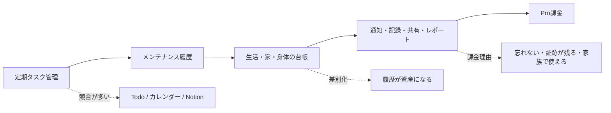
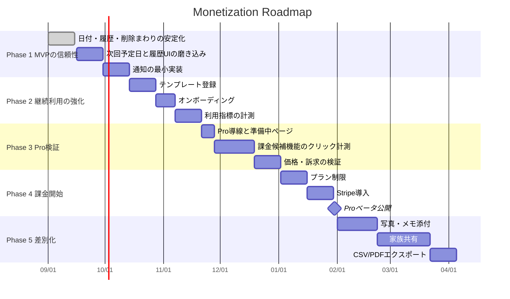
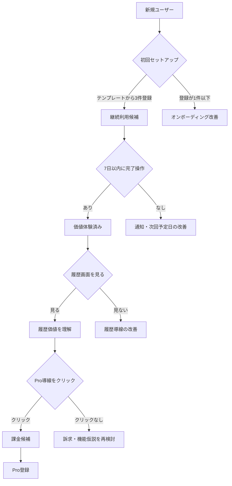
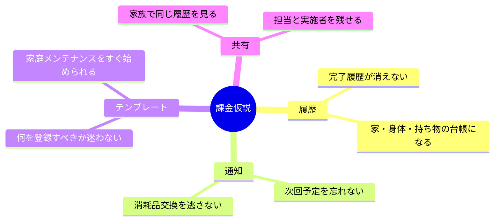

# メグループ マネタイズロードマップ

## 目的

メグループを「定期タスクのリマインダー」から、暮らし・持ち物・身体まわりのメンテナンス履歴を残せるサービスへ育て、無料利用から自然に有料化できる状態を作る。

## ポジショニング

## 全体ロードマップ

## 収益化ファネル

## フェーズ別マイルストーン

| Phase | ゴール | 主な実装 | 判断指標 |
| --- | --- | --- | --- |
| Phase 1 | MVPを安心して使える状態にする | 日付ずれ修正、履歴保持、削除時の整合性、通知の最小実装 | 主要CI成功、完了操作の成功率、履歴表示の利用 |
| Phase 2 | 継続利用の理由を作る | テンプレート、次回予定日、オンボーディング、利用指標計測 | 初回3件登録率、7日後継続率、完了操作率 |
| Phase 3 | 課金理由を検証する | Pro導線、準備中ページ、クリック計測、価格訴求 | Proクリック率、メール登録率、機能別関心 |
| Phase 4 | 最初の売上を作る | Stripe、プラン制限、Proベータ | 有料転換率、解約率、サポート負荷 |
| Phase 5 | 差別化を強める | 写真・メモ添付、家族共有、CSV/PDF、年間レポート | Pro継続率、家族招待率、エクスポート利用 |

## Free / Pro の初期案

| 機能 | Free | Pro |
| --- | --- | --- |
| タスク数 | 10件まで | 無制限 |
| 履歴 | 90日まで | 無制限 |
| テンプレート | 基本セット | 全テンプレート |
| 通知 | 基本通知 | 高度な通知 |
| 写真・メモ添付 | なし | あり |
| エクスポート | なし | CSV / PDF |
| 家族共有 | なし | あり |

## 最初に検証する課金仮説

## 直近の優先順位

1. 次回予定日と履歴画面の体験を磨く。
2. テンプレートからタスクを作れるようにする。
3. 通知を最小構成で入れる。
4. Pro準備中ページを作り、クリックとメール登録を測る。
5. 写真・メモ添付をPro候補として実装する。
6. Stripe決済とプラン制限を入れる。

## 保留するもの

- AIによる自動テンプレート生成: API費用が出るため、Pro検証後に判断する。
- 家族共有: 価値は高いが、権限設計が重いためPhase 5で扱う。
- モバイルアプリ化: Webで継続率と課金意向を確認してから判断する。
