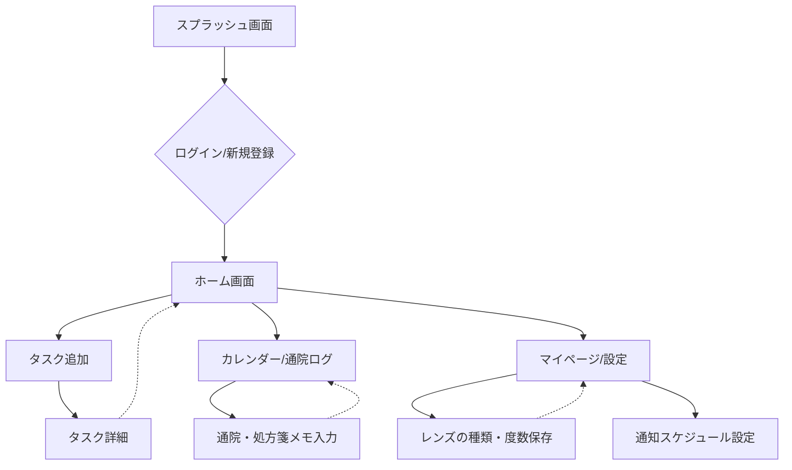

# 画面遷移図

```mermaid
graph TD
    A[スプラッシュ画面] --> B{ログイン/新規登録}
    B --> C[ホーム画面]

    %% ホームからの遷移
    C --> D[タスク追加]
    C --> E[カレンダー/通院ログ]
    C --> F[マイページ/設定]

    %% 各詳細
    D --> D1[タスク詳細]
    E --> E1[通院・処方箋メモ入力]
    F --> F1[レンズの種類・度数保存]
    F --> F2[通知スケジュール設定]

    %% 戻る動線
    D1 -.-> C
    E1 -.-> E
    F1 -.-> F
```
